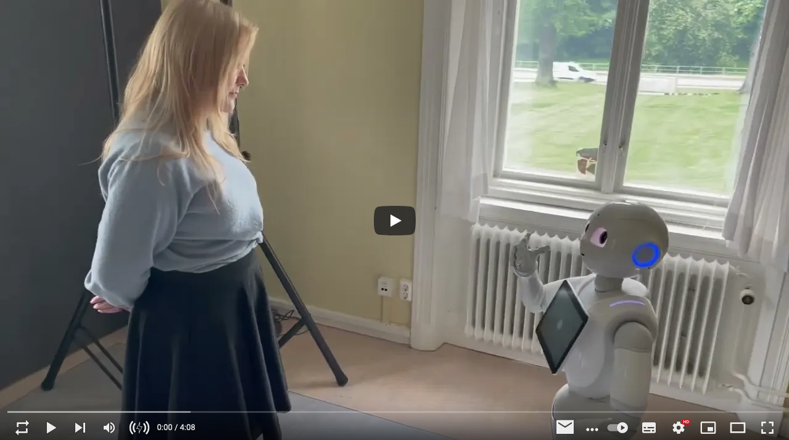

# PepperChat

The code aims to give Pepper basic conversation abilities, this includes a speech recognition module, a conversational engine to formulate the answers and the speech synthesis.

This is a fork of Igor Lirussi's [Pepper Dialogue System](https://github.com/igor-lirussi/Dialogue-Pepper-Robot).

## Video of the Result
[](https://youtu.be/zip90jyv1i4)

## Installation
With git bash you have to clone, possibly with SSH, the repository with the following command. <br>
**Pay attention to clone also the submodules with the --recurse-submodules or some parts of the project will miss**
```
git clone --recurse-submodules <repo_link>
```

## Setup

NaoQi is old and runs on Python 2.7 while OpenAI requires Python 3. We therefore need both Python versions installed. Here's a step by step guide for setup on Windows 11.

1. Make sure Python 3.x is installed on the system. 
1. Install [Python 2.7](https://www.python.org/downloads/release/python-2718/). Select the 32 bit msi installer.
1. Add ```C:\Python27``` to the environment PATH.
1. Open a terminal and verify that ```python``` refers to Python2.7 and ```python3``` refers to your Python 3.x distribution. 

Now we need a few of dependencies:

* Install all dependencies for Python 2: ```python -m pip install -r .\requirements.py2.txt```
* Install all dependencies for Python 3: ```python3 -m pip install -r .\requirements.py3.txt```

We will use VS Code to run things, you may also use another environment if you prefer. 

Now we need the Python NaoQi API for communicating with the Pepper robot. 

* Download and extract [NaoQi Python SDK](https://www.softbankrobotics.com/emea/en/support/pepper-naoqi-2-9/downloads-softwares/former-versions?os=45&category=108) to a folder (pynaoqi-python2.7-2.5.7.1-win32-vs2013/lib) of your choice and add its path the PYTHONPATH environment variable in Windows. 
* You may also want to install [Choreographe 2.5.10.7](https://www.softbankrobotics.com/emea/en/support/pepper-naoqi-2-9/downloads-softwares/former-versions?os=45&category=108). It is however not strictly needed. 

Finally, we are ready to check out the repository. 

* Check out this repository and open the folder in VS Code
* Now run ```python init.py``` to set up a default environment. Have your OpenAI account key available so that this can be stored with your configuration. 

## Run
Make sure you've gone through all steps in the Setup guide above beofre you start. 

* Start the OpenAI GPT-3 chatbot service by opening a terminal and execute ```python3 startDialogueServer.py```. If everything goes well, the server should respond with _Starting OpenAI chat server...
Type an input message to test your chatbot..._
* Next, start Google's text to speech recognition service for Pepper by opening a new terminal and execute ```python module_speechrecognition.py --pip pepper.local``` (where _pepper.local_ refers to your robot's ip).
* We are now ready to start the dialogue service by opening another terminal and executing ```python module_dialogue.py --pip pepper.local```. This script will ask for a participant id and then connect to the OpenAI chatbot server we started earlier. If everything goes well it will continue and register another NaoQi module that runs the dialogue. _Pepper should now be ready to chat!_

## License

Please refer to [LICENSE.md](LICENSE.md) for license details.

## Acknowledgments
* Erik Billing @ University of Skövde, Sweden - for adapting this library with OpenAI GPT-3 dialogue system. 
* Igor Lirussi @ Cognitive Learning and Robotics Laboratory at Boğaziçi University, Istanbul - for releasing the base module on which this project is built. 
* Johannes Bramauer @ Vienna University of Technology - for the [PepperSpeechRecognition](https://github.com/JBramauer/pepperspeechrecognition)
* Anthony Zang (Uberi) and his [SpeechRecognition](https://github.com/Uberi/speech_recognition)
